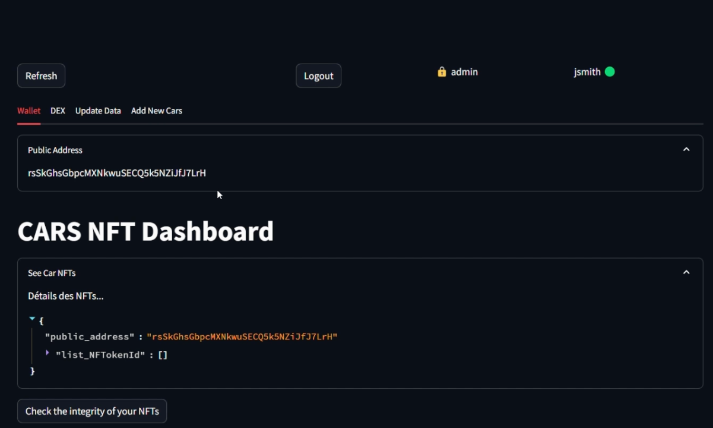
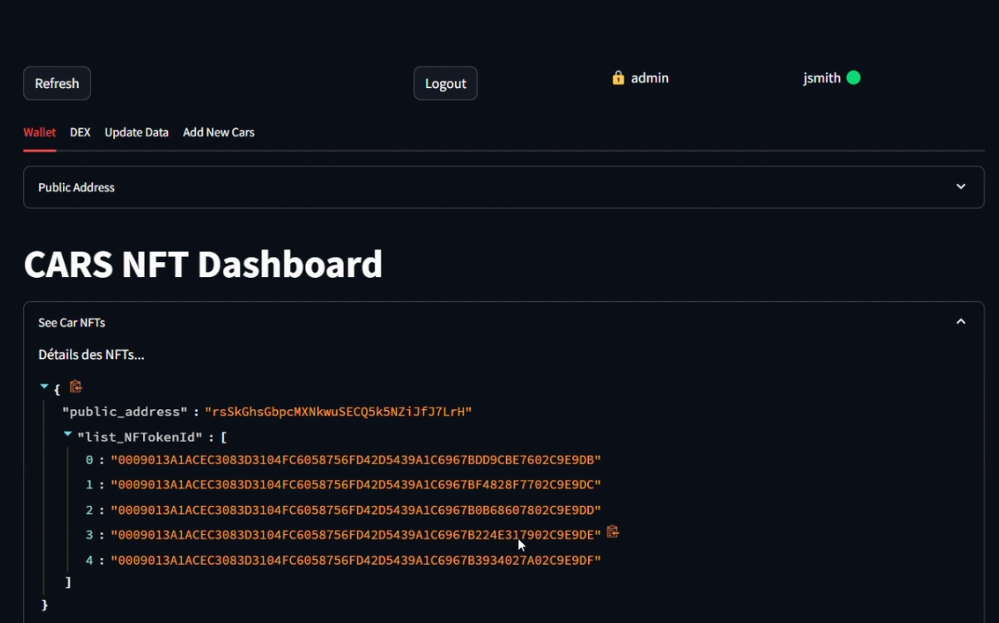
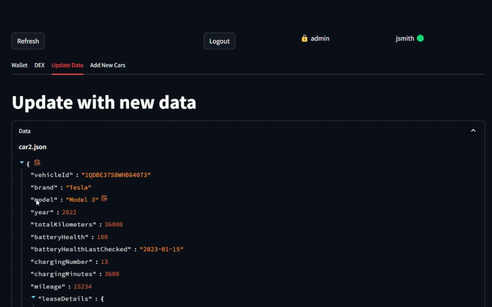
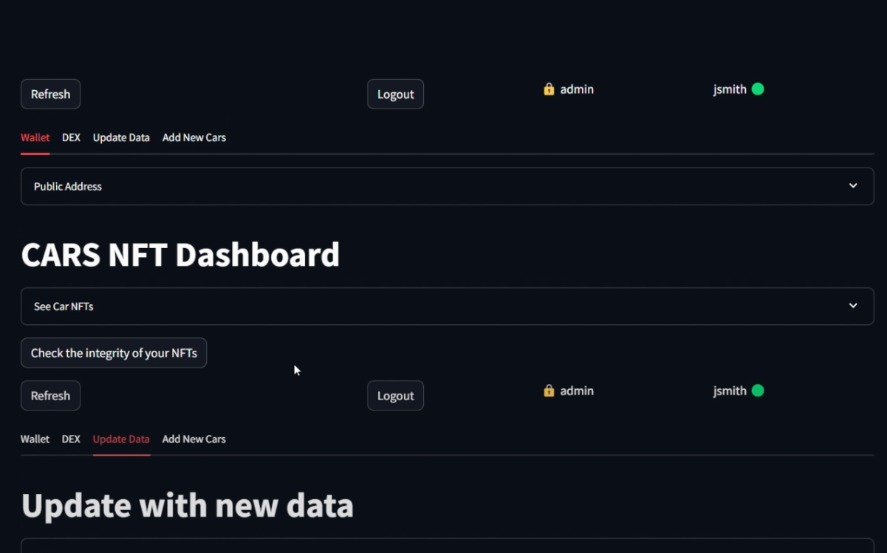
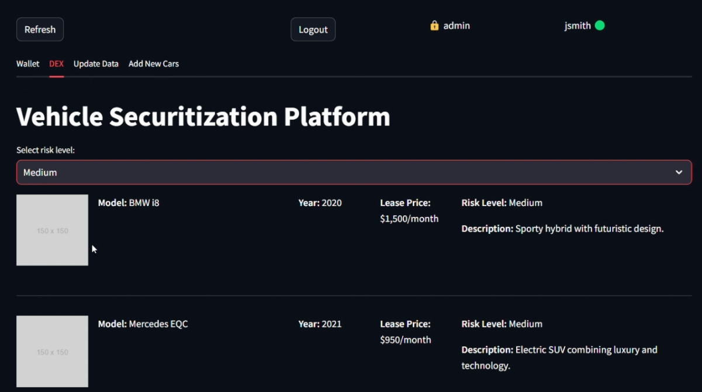

# PBW Cara7

<details open>
  <summary><strong>French</strong></summary>

Dans le cadre de la Paris Blockchain Week, nous avons conçu une preuve de concept (PoC) pour un service de titrisation exploitant la blockchain XRP.

## Problématique :

Les sociétés de financement des constructeurs automobiles cèdent les contrats de financement à des fonds de pension. Ces derniers nécessitent des données financières détaillées, impliquant de nombreuses heures d'analyse par des experts et un volume limité de données disponibles.

Ce projet vise à optimiser la titrisation des contrats de leasing automobile, en assurant une transparence accrue concernant la santé financière des leasing et l'état des véhicules.

Une meilleure information dans ce domaine favorisera une maturité accrue des leasing et contribuera à une démocratisation plus importante des voitures électriques.

## Fonctionnement technique :

#### Création du NFT et smartcontract sur EVM

Lorsque la voiture est vendue, [un jeton non fongible (NFT)](https://github.com/AntoineA67/pbw-cara7/blob/main/script/1_Create.py) est créé sur la blockchain XRP. Ce NFT contient [l'adresse d'un contrat intelligent situé sur l'EVM](https://github.com/AntoineA67/pbw-cara7/blob/main/evm-interaction/contracts/HashStorage.sol)  (Ethereum Virtual Machine), lequel conserve une collection de hachages de fichiers historiques représentant l'état passé de la voiture ainsi que sa santé financière.

[](https://miro.com/app/board/uXjVKXynQg8=/?moveToViewport=-2594,1316,2684,1234&embedId=215828249926)

#### Mise à jour des informations techniques et financière

Périodiquement, les données techniques et financières sont transmises à une [agrégation de données](https://github.com/AntoineA67/pbw-cara7/blob/main/script/2_Update.py), puis elles sont enregistrées dans un fichier JSON. Ensuite, un hachage de ce fichier est généré et stocké dans un contrat intelligent sur l'EVM (Ethereum Virtual Machine) d'XRP. Ce contrat intelligent permet de récupérer tous les hachages qui y ont été ajoutés et d'ajouter de nouveaux hachages, sans possibilité de modifier les hachages déjà existants.

[](https://miro.com/app/live-embed/uXjVKXynQg8=/?moveToViewport=-2250,2617,2189,1006&embedId=328669422631)

#### Analyse financière et trunching en plusieurs profiles de risques

Après une certaine durée de vie du véhicule, un processus de trunching est déclenché en fonction de l'évaluation du risque technique du véhicule ainsi que des capacités de remboursement actuelles et futures de l'acheteur, afin de classifier le niveau de risque. Dans notre cas, nous classons les véhicules représentés par des NFT dans trois portefeuilles distincts, chacun représentant des niveaux de risque différents.

Les NFT sont destinés à être associés à ces différents portefeuilles afin d'être acquis tant par des fonds d'investissement désireux de prendre en charge le risque jusqu'à la fin de la maturité du leasing que par des particuliers qui peuvent investir dans cet actif via un échange décentralisé (DEX).

[](https://miro.com/app/live-embed/uXjVKXynQg8=/?moveToViewport=-2387,3742,2624,1207&embedId=338572393257)

[](https://miro.com/app/live-embed/uXjVKXynQg8=/?moveToViewport=-2736,5242,4017,1847&embedId=56264919248)

## Configuration :


Éditez le fichier suivant `\evm-interaction\.env` :

```
EVM_XRP_MNEMONIC="your mnemonic"
```

Éditez le fichier suivant `\scripts\.env` :

```
XRP_WALLET_SEED="your xrp seed"
```

Éditez le fichier suivant `\confs\secrets.yaml` 


## Lancement du projet :

Pour lancer le projet, exécutez la commande suivante :

```
make install
```

```
make run
```

## Captures d'écran :








</details>

<details open>
  <summary><strong>English</strong></summary>

As part of the Paris Blockchain Week, we have designed a proof of concept (PoC) for a securitization service leveraging the XRP blockchain.

## Issue:

Automobile manufacturer financing companies transfer financing contracts to pension funds. The latter require detailed financial data, involving many hours of analysis by experts and a limited volume of available data.

This project aims to optimize the securitization of automobile leasing contracts, ensuring increased transparency regarding the financial health of the leases and the condition of the vehicles.

Better information in this area will promote increased maturity of leases and contribute to greater democratization of electric cars.

## Technical Operation:

#### Creation of NFT and smart contract on EVM

When the car is sold, [a non-fungible token (NFT)](https://github.com/AntoineA67/pbw-cara7/blob/main/script/1_Create.py) is created on the XRP blockchain. This NFT contains [the address of a smart contract located on the EVM](https://github.com/AntoineA67/pbw-cara7/blob/main/evm-interaction/contracts/HashStorage.sol), which maintains a collection of hashes of historical files representing the past state of the car as well as its financial health.

[](https://miro.com/app/board/uXjVKXynQg8=/?moveToViewport=-2594,1316,2684,1234&embedId=215828249926)

#### Update of technical and financial information

Periodically, technical and financial data are transmitted to a [data aggregation](https://github.com/AntoineA67/pbw-cara7/blob/main/script/2_Update.py), then they are recorded in a JSON file. Next, a hash of this file is generated and stored in a smart contract on the XRP EVM (Ethereum Virtual Machine). This smart contract allows retrieving all the hashes that have been added to it and adding new hashes, without the possibility of modifying the existing hashes.

[](https://miro.com/app/live-embed/uXjVKXynQg8=/?moveToViewport=-2250,2617,2189,1006&embedId=328669422631)

#### Financial analysis and tranching into multiple risk profiles

After a certain lifespan of the vehicle, a tranching process is triggered based on the assessment of the vehicle's technical risk as well as the current and future repayment capabilities of the buyer, in order to classify the risk level. In our case, we classify the vehicles represented by NFTs into three distinct portfolios, each representing different risk levels.

The NFTs are intended to be associated with these different portfolios in order to be acquired by both investment funds willing to take on the risk until the maturity of the lease and by individuals who can invest in this asset via a decentralized exchange (DEX).

[](https://miro.com/app/live-embed/uXjVKXynQg8=/?moveToViewport=-2387,3742,2624,1207&embedId=338572393257)

[](https://miro.com/app/live-embed/uXjVKXynQg8=/?moveToViewport=-2736,5242,4017,1847&embedId=56264919248)

## Configuration :

Edit the following file `\evm-interaction\.env`:

```
EVM_XRP_MNEMONIC="your mnemonic"
```

Edit the following file `\scripts\.env`:

```
XRP_WALLET_SEED="your xrp seed"
```

Edit the following file `\confs\secrets.yaml` 

## Project Launch:

To launch the project, run the following command:

```
make install
```

```
make run
```

## Screenshots:


</details>